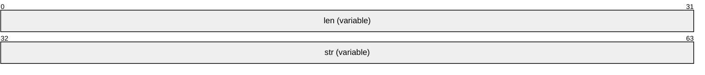
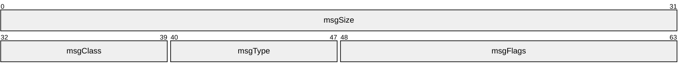
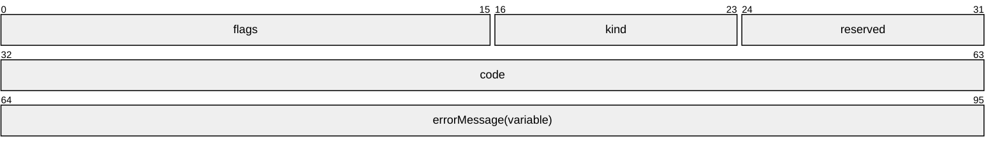
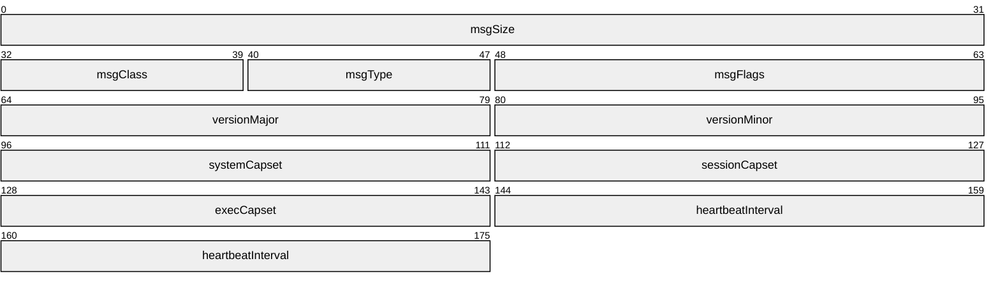
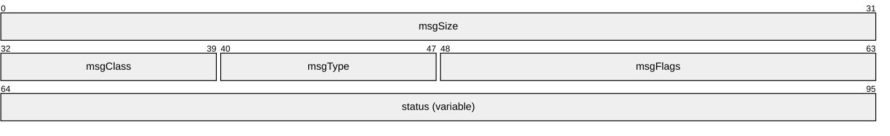
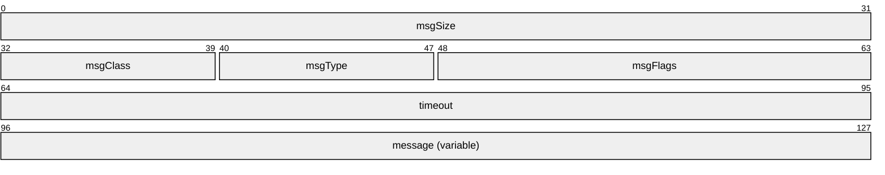
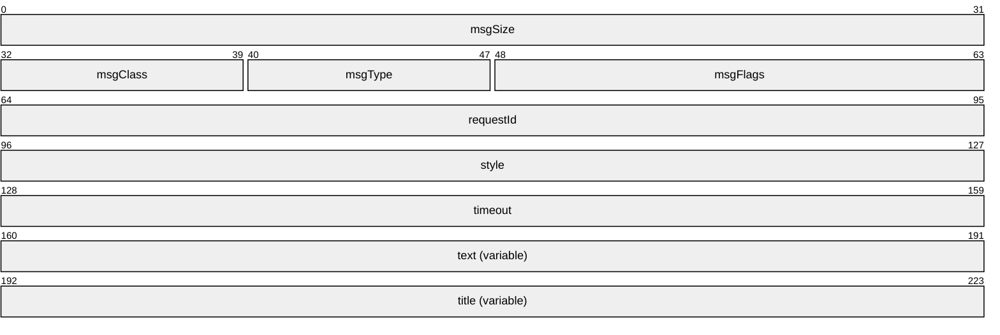
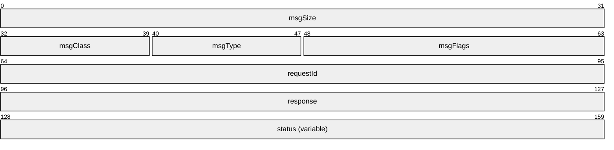
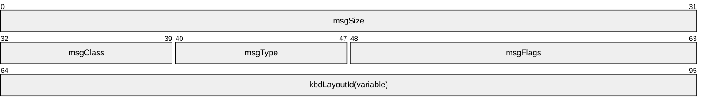
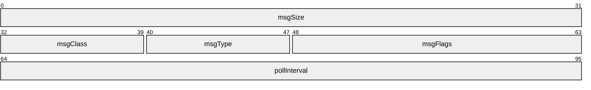

<!--
TOC is generated in [Obsidian](obsidian.md) via
[TOC plugin](https://github.com/hipstersmoothie/obsidian-plugin-toc)
-->
# NOW-PROTO 1.5
- [Messages](#messages)
	- [Transport](#transport)
	- [Message Syntax](#message-syntax)
		- [Common Structures](#common-structures)
			- [NOW_INTEGER](#now_integer)
				- [NOW_VARU32](#now_varu32)
			- [NOW_STRING](#now_string)
				- [NOW_VARSTR](#now_varstr)
				- [NOW_GUID](#now_guid)
			- [NOW_BUFFER](#now_buffer)
				- [NOW_VARBUF](#now_varbuf)
			- [NOW_HEADER](#now_header)
			- [NOW_STATUS](#now_status)
		- [Channel Messages](#channel-messages)
			- [NOW_CHANNEL_MSG](#now_channel_msg)
			- [NOW_CHANNEL_CAPSET_MSG](#now_channel_capset_msg)
			- [NOW_CHANNEL_HEARTBEAT_MSG](#now_channel_heartbeat_msg)
			- [NOW_CHANNEL_CLOSE_MSG](#now_channel_close_msg)
		- [System Messages](#system-messages)
			- [NOW_SYSTEM_MSG](#now_system_msg)
			- [NOW_SYSTEM_SHUTDOWN_MSG](#now_system_shutdown_msg)
		- [Session Messages](#session-messages)
			- [NOW_SESSION_MSG](#now_session_msg)
			- [NOW_SESSION_LOCK_MSG](#now_session_lock_msg)
			- [NOW_SESSION_LOGOFF_MSG](#now_session_logoff_msg)
			- [NOW_SESSION_MSGBOX_REQ_MSG](#now_session_msgbox_req_msg)
			- [NOW_SESSION_MSGBOX_RSP_MSG](#now_session_msgbox_rsp_msg)
			- [NOW_SESSION_SET_KBD_LAYOUT_MSG](#now_session_set_kbd_layout_msg)
		- [Execution Messages](#execution-messages)
			- [NOW_EXEC_MSG](#now_exec_msg)
			- [NOW_EXEC_ABORT_MSG](#now_exec_abort_msg)
			- [NOW_EXEC_CANCEL_REQ_MSG](#now_exec_cancel_req_msg)
			- [NOW_EXEC_CANCEL_RSP_MSG](#now_exec_cancel_rsp_msg)
			- [NOW_EXEC_RESULT_MSG](#now_exec_result_msg)
			- [NOW_EXEC_DATA_MSG](#now_exec_data_msg)
			- [NOW_EXEC_STARTED_MSG](#now_exec_started_msg)
			- [NOW_EXEC_RUN_MSG](#now_exec_run_msg)
			- [NOW_EXEC_PROCESS_MSG](#now_exec_process_msg)
			- [NOW_EXEC_SHELL_MSG](#now_exec_shell_msg)
			- [NOW_EXEC_BATCH_MSG](#now_exec_batch_msg)
			- [NOW_EXEC_WINPS_MSG](#now_exec_winps_msg)
			- [NOW_EXEC_PWSH_MSG](#now_exec_pwsh_msg)
		- [RDM Messages](#rdm-messages)
			- [NOW_RDM_MSG](#now_rdm_msg)
			- [NOW_RDM_CAPABILITIES_MSG](#now_rdm_capabilities_msg)
			- [NOW_RDM_APP_START_MSG](#now_rdm_app_start_msg)
			- [NOW_RDM_APP_ACTION_MSG](#now_rdm_app_action_msg)
			- [NOW_RDM_APP_NOTIFY_MSG](#now_rdm_app_notify_msg)
			- [NOW_RDM_SESSION_START_MSG](#now_rdm_session_start_msg)
			- [NOW_RDM_SESSION_ACTION_MSG](#now_rdm_session_action_msg)
			- [NOW_RDM_SESSION_NOTIFY_MSG](#now_rdm_session_notify_msg)
		- [Version History](#version-history)

# Messages

## Transport

The NOW virtual channel protocol use an RDP dynamic virtual channel ("Devolutions::Now::Agent") as a transport type.

## Message Syntax

The following sections specify the NOW protocol message syntax.
Unless otherwise specified, all fields defined in this document use the little-endian format.

### Common Structures

#### NOW_INTEGER

Signed and unsigned integer encoding structures of various sizes.

##### NOW_VARU32

The NOW_VARU32 structure is used to encode signed integer values in the range [0, 0x3FFFFFFF].


**c (2 bits)**: A 2-bit integer containing an encoded representation of the number of bytes in this structure.

| Value | Meaning |
|-------|---------|
| 0 | The val1 field is present (1 byte). |
| 1 | The val1, val2 fields are present (2 bytes). |
| 2 | The val1, val2, val3 fields are present (3 bytes). |
| 3 | The val1, val2, val3, val4 fields are present (4 bytes). |

**val1 (6 bits)**: A 6-bit integer containing the 6 most significant bits of the integer value represented by this structure.

**val2 (1 byte)**: An 8-bit integer containing the second most significant bits of the integer value represented by this structure.

**val3 (1 byte)**: An 8-bit integer containing the third most significant bits of the integer value represented by this structure.

**val4 (1 byte)**: An 8-bit integer containing the least significant bits of the integer value represented by this structure.

#### NOW_STRING

##### NOW_VARSTR

The NOW_VARSTR structure is used to represent variable-length strings that could be large, while remaining compact in size for small strings.



**len (variable)**: A NOW_VARU32 structure containing the string length, excluding the null terminator.

**str (variable)**: The UTF-8 encoded string excluding the null terminator.

##### NOW_GUID

The NOW_GUID structure is a GUID encoded in a NOW_VARSTR structure, as a lowercase string of 36 characters. Implementations should use the NOW_VARSTR type, but refer to the NOW_GUID definition for validation.


**len (variable)**: A NOW_VARU32 structure containing the string length (36), excluding the null terminator.

**str (variable)**: The UTF-8 encoded lowercase GUID string, excluding the null terminator, like this: 00112233-4455-6677-8899-aabbccddeeff. If the value is omitted, use the null GUID value: 00000000-0000-0000-0000-000000000000.

#### NOW_BUFFER

##### NOW_VARBUF

The NOW_VARBUF structure is used to represent variable-length buffers.


**size (variable)**: A NOW_VARU32 structure containing the buffer size.

**data (variable)**: The buffer data, whose size is given by the size field.

#### NOW_HEADER

The NOW_HEADER structure is the header common to all NOW protocol messages.



**msgSize (4 bytes)**: The message size, excluding the header size (8 bytes).

**msgClass (1 byte)**: The message class.

| Flag                            | Meaning              |
|---------------------------------|----------------------|
| NOW_CHANNEL_MSG_CLASS_ID<br>0x10 | Channel message class. |
| NOW_SYSTEM_MSG_CLASS_ID<br>0x11 | System message class. |
| NOW_SESSION_MSG_CLASS_ID<br>0x12 | Session message class. |
| NOW_EXEC_MSG_CLASS_ID<br>0x13 | Exec message class. |
| NOW_RDM_MSG_CLASS_ID<br>0x14 | RDM message class. |

**msgType (1 byte)**: The message type, specific to the message class.

**msgFlags (2 bytes)**: The message flags, specific to the message type and class.

#### NOW_STATUS
Operation status code.



**flags (2 bytes)**: Status flags.

| Value | Meaning |
|-------|---------|
| NOW_STATUS_ERROR<br>0x0001 | This flag set for all error statuses. If flag is not set, operation was successful. |
| NOW_STATUS_ERROR_MESSAGE<br>0x0002 | `errorMessage` contains optional error message. |

**kind (1 byte)**: The status kind.
When `NOW_STATUS_ERROR` is set, this field represents error kind.

| Value | Meaning |
|-------|---------|
| NOW_STATUS_ERROR_KIND_GENERIC<br>0x0000 | `code` value is undefined and could be ignored. |
| NOW_STATUS_ERROR_KIND_NOW<br>0x0001 | `code` contains NowProto-defined error code. |
| NOW_STATUS_ERROR_KIND_WINAPI<br>0x0002 | `code` field contains Windows error code. |
| NOW_STATUS_ERROR_KIND_UNIX<br>0x0003 | `code` field contains Unix error code. |

For successful operation this field value is operation specific.

**reserved (1 byte)**: Reserved value. Should be set to 0 and ignored during parsing.

**code (4 bytes)**: The status code.

- If `NOW_STATUS_ERROR` flag is NOT set, this value should contain `0` value
- If `NOW_STATUS_ERROR` is set, this value represents error code according to
  `NOW_STATUS_ERROR_KIND_*` value. If no error kind flags set, value of this
  field is undefined and should be ignored.

    - `NOW_STATUS_ERROR_KIND_NOW` codes:

        | Value | Meaning |
        |-------|---------|
        | NOW_CODE_IN_USE<br>0x0001 | Resource (e.g. exec session id is already in use). |
        | NOW_CODE_INVALID_REQUEST<br>0x0002 | Sent request is invalid (e.g. invalid exec request params). |
        | NOW_CODE_ABORTED<br>0x0003 | Operation has been aborted on the server side. |
        | NOW_CODE_NOT_FOUND<br>0x0004 | Resource not found. |
        | NOW_CODE_ACCESS_DENIED<br>0x0005 | Resource can't be accessed. |
        | NOW_CODE_INTERNAL<br>0x0006 | Internal error. |
        | NOW_CODE_NOT_IMPLEMENTED<br>0x0007 | Operation is not implemented on current platform. |
        | NOW_CODE_PROTOCOL_VERSION<br>0x0008 | Incompatible protocol versions. |

    - `NOW_STATUS_ERROR_KIND_WINAPI`: code contains standard WinAPI error.
    - `NOW_STATUS_ERROR_KIND_UNIX`: code contains standard UNIX error code.

**errorMessage(variable)**: this value contains either an error message if
`NOW_STATUS_ERROR_MESSAGE` flag is set, or empty string if the flag is not set.

### Channel Messages
Channel negotiation and life cycle messages.

#### NOW_CHANNEL_MSG


**msgSize (4 bytes)**: The message size, excluding the header size (8 bytes).

**msgClass (1 byte)**: The message class (NOW_NEGOTIATION_MSG_CLASS_ID).

**msgType (1 byte)**: The message type.

| Value                           | Meaning              |
|---------------------------------|----------------------|
| NOW_CHANNEL_CAPSET_MSG_ID<br>0x01 | NOW_CHANNEL_CAPSET_MSG |
| NOW_CHANNEL_HEARTBEAT_MSG_ID<br>0x02 | NOW_CHANNEL_HEARTBEAT_MSG |
| NOW_CHANNEL_CLOSE_MSG_ID<br>0x03 | NOW_CHANNEL_CLOSE_MSG |

#### NOW_CHANNEL_CAPSET_MSG

This message is first set by the client side, to advertise capabilities.

Received client message should be downgraded by the server (remove non-intersecting capabilities)
and sent back to the client at the start of DVC channel communications. DVC channel should be
closed if protocol versions are not compatible.



**msgSize (4 bytes)**: The message size, excluding the header size (8 bytes).

**msgClass (1 byte)**: The message class (NOW_CHANNEL_MSG_CLASS_ID).

**msgType (1 byte)**: The message type (NOW_CHANNEL_CAPSET_MSG_ID).

**msgFlags (2 bytes)**: Message flags.

| Flag | Meaning |
|-------|---------|
| NOW_CHANNEL_SET_HEARTBEAT<br>0x0001 | Set if `heartbeat` specify channel heartbeat interval. |

**versionMajor (2 bytes)**: Major protocol version. Breaking changes in protocol should
increment major version; Protocol implementations with different major version are not compatible.

**versionMinor (2 bytes)**: Minor protocol version. Incremented when new non-breaking feature is added.

**systemCapset (2 bytes)**: System commands capabilities set.

| Flag | Meaning |
|-------|---------|
| NOW_CAP_SYSTEM_SHUTDOWN<br>0x0001 | System shutdown command support. |

**sessionCapset (2 bytes)**: Session commands capabilities set.

| Flag | Meaning |
|-------|---------|
| NOW_CAP_SESSION_LOCK<br>0x0001 | Session lock command support. |
| NOW_CAP_SESSION_LOGOFF<br>0x0002 | Session logoff command support. |
| NOW_CAP_SESSION_MSGBOX<br>0x0004 | Message box command support. |
| NOW_CAP_SESSION_SET_KBD_LAYOUT<br>0x0008 | Set keyboard layout command support. |

**execCapset (2 bytes)**: Remote execution capabilities set.

| Flag | Meaning |
|-------|---------|
| NOW_CAP_EXEC_STYLE_RUN<br>0x0001 | Generic "Run" execution style. |
| NOW_CAP_EXEC_STYLE_PROCESS<br>000002 | CreateProcess() execution style. |
| NOW_CAP_EXEC_STYLE_SHELL<br>0x0004 | System shell (.sh) execution style. |
| NOW_CAP_EXEC_STYLE_BATCH<br>0x0008 | Windows batch file (.bat) execution style. |
| NOW_CAP_EXEC_STYLE_WINPS<br>0x0010 | Windows PowerShell (.ps1) execution style. |
| NOW_CAP_EXEC_STYLE_PWSH<br>0x0020 | PowerShell 7 (.ps1) execution style. |
| NOW_CAP_EXEC_IO_REDIRECTION<br>0x1000 | Set if host implements exec session IO redirection. |

<!-- TODO: add AppleScript command -->

**heartbeatInterval (4 bytes, optional)**: A 32-bit unsigned integer, which represents
periodic heartbeat interval *hint* for a server (60 seconds by default).
Disables periodic heartbeat if set to `0`. Ignored if `NOW_CHANNEL_SET_HEARTBEAT` is not set.


#### NOW_CHANNEL_HEARTBEAT_MSG

Periodic heartbeat message sent by the server. If the client does not receive this message within
the specified interval, it should consider the connection as lost.


**msgSize (4 bytes)**: The message size, excluding the header size (8 bytes).

**msgClass (1 byte)**: The message class (NOW_CHANNEL_MSG_CLASS_ID).

**msgType (1 byte)**: The message type (NOW_CHANNEL_HEARTBEAT_MSG_ID).

**msgFlags (2 bytes)**: The message flags.

#### NOW_CHANNEL_CLOSE_MSG

Channel close notice, could be sent by either parties at any moment of communication to gracefully
close DVC channel.



**msgSize (4 bytes)**: The message size, excluding the header size (8 bytes).

**msgClass (1 byte)**: The message class (NOW_CHANNEL_MSG_CLASS_ID).

**msgType (1 byte)**: The message type (NOW_CHANNEL_CLOSE_MSG_ID).

**msgFlags (2 bytes)**: The message flags.

**status (variable)**: Channel close status represented as NOW_STATUS structure.

### System Messages

#### NOW_SYSTEM_MSG


**msgSize (4 bytes)**: The message size, excluding the header size (8 bytes).

**msgClass (1 byte)**: The message class (NOW_SYSTEM_MSG_CLASS_ID).

**msgType (1 byte)**: The message type.

| Value                           | Meaning              |
|---------------------------------|----------------------|
| NOW_SYSTEM_INFO_REQ_ID<br>0x01 | NOW_SYSTEM_INFO_REQ_MSG |
| NOW_SYSTEM_INFO_RSP_ID<br>0x02 | NOW_SYSTEM_INFO_RSP_MSG |
| NOW_SYSTEM_SHUTDOWN_ID<br>0x03 | NOW_SYSTEM_SHUTDOWN_MSG |

<!-- TODO: Define NOW_SYSTEM_INFO_REQ_MSG, NOW_SYSTEM_INFO_RSP_MSG   -->

#### NOW_SYSTEM_SHUTDOWN_MSG

The NOW_SYSTEM_SHUTDOWN_MSG structure is used to request a system shutdown.



**msgSize (4 bytes)**: The message size, excluding the header size (8 bytes).

**msgClass (1 byte)**: The message class (NOW_SYSTEM_MSG_CLASS_ID).

**msgType (1 byte)**: The message type (NOW_SYSTEM_SHUTDOWN_MSG_ID)

**msgFlags (2 bytes)**: The message flags.

| Flag | Meaning |
|------|---------|
| NOW_SHUTDOWN_FLAG_FORCE<br>0x0001 | Force shutdown |
| NOW_SHUTDOWN_FLAG_REBOOT<br>0x0002 | Reboot after shutdown |

**timeout (4 bytes)**: This system shutdown timeout, in seconds.

**message (variable)**: A NOW_STRING structure containing an optional shutdown message.

### Session Messages

#### NOW_SESSION_MSG


**msgSize (4 bytes)**: The message size, excluding the header size (8 bytes).

**msgClass (1 byte)**: The message class (NOW_SESSION_MSG_CLASS_ID).

**msgType (1 byte)**: The message type.

| Value                           | Meaning              |
|---------------------------------|----------------------|
| NOW_SESSION_LOCK_MSG_ID<br>0x01 | NOW_SESSION_LOCK_MSG |
| NOW_SESSION_LOGOFF_MSG_ID<br>0x02 | NOW_SESSION_LOGOFF_MSG |
| NOW_SESSION_MESSAGE_BOX_MSG_REQ_ID<br>0x03 | NOW_SESSION_MESSAGE_BOX_MSG |
| NOW_SESSION_MESSAGE_BOX_RSP_MSG_ID<br>0x04 | NOW_SESSION_MESSAGE_RSP_MSG |
| NOW_SESSION_SWITCH_KBD_LAYOUT_MSG_ID<br>0x05 | NOW_SESSION_SWITCH_KBD_LAYOUT_MSG |
| NOW_SESSION_WINDOW_REC_START_MSG_ID<br>0x06 | NOW_SESSION_WINDOW_REC_START_MSG |
| NOW_SESSION_WINDOW_REC_STOP_MSG_ID<br>0x07 | NOW_SESSION_WINDOW_REC_STOP_MSG |
| NOW_SESSION_WINDOW_REC_EVENT_MSG_ID<br>0x08 | NOW_SESSION_WINDOW_REC_EVENT_MSG |

**msgFlags (2 bytes)**: The message flags.

#### NOW_SESSION_LOCK_MSG

The NOW_SESSION_LOCK_MSG is used to request locking the user session.


**msgSize (4 bytes)**: The message size, excluding the header size (8 bytes).

**msgClass (1 byte)**: The message class (NOW_SESSION_MSG_CLASS_ID).

**msgType (1 byte)**: The message type (NOW_SESSION_LOCK_MSG_ID).

**msgFlags (2 bytes)**: The message flags.

#### NOW_SESSION_LOGOFF_MSG

The NOW_SESSION_LOGOFF_MSG is used to request a user session logoff.


**msgSize (4 bytes)**: The message size, excluding the header size (8 bytes).

**msgClass (1 byte)**: The message class (NOW_SESSION_MSG_CLASS_ID).

**msgType (1 byte)**: The message type (NOW_SESSION_LOGOFF_MSG_ID).

**msgFlags (2 bytes)**: The message flags.

#### NOW_SESSION_MSGBOX_REQ_MSG

The NOW_SESSION_MSGBOX_REQ_MSG is used to show a message box in the user session, similar to what the [WTSSendMessage function](https://learn.microsoft.com/en-us/windows/win32/api/wtsapi32/nf-wtsapi32-wtssendmessagew) does.



**msgSize (4 bytes)**: The message size, excluding the header size (8 bytes).

**msgClass (1 byte)**: The message class (NOW_SESSION_MSG_CLASS_ID).

**msgType (1 byte)**: The message type (NOW_SESSION_MESSAGE_BOX_MSG_ID).

**msgFlags (2 bytes)**: The message flags.

| Flag                                | Meaning                                 |
|-------------------------------------|-----------------------------------------|
| NOW_MSGBOX_FLAG_TITLE<br>0x0001 | The `title` field is contains a non-default value. |
| NOW_MSGBOX_FLAG_STYLE<br>0x0002 | The `style` field contains a non-default value. |
| NOW_MSGBOX_FLAG_TIMEOUT<br>0x0004 | The `timeout` field contains a non-default value. |
| NOW_MSGBOX_FLAG_RESPONSE<br>0x0008 | A response message is expected (don't fire and forget). |

**requestId (4 bytes)**: the message request id, sent back in the response.

**style (4 bytes)**: The message box style, ignored if NOW_MSGBOX_FLAG_STYLE is not set. MBOK is the default, refer to the
[MessageBox function](https://learn.microsoft.com/en-us/windows/win32/api/winuser/nf-winuser-messagebox)
for all possible styles. This field may be ignored on platforms other than Windows.

**timeout (4 bytes)**: The timeout, in seconds, that the message box dialog should wait for the user response. This value is ignored if NOW_MSGBOX_FLAG_TIMEOUT is not set.

**text (variable)**: The message box text.

**title (variable)**: The message box title. Ignored if NOW_MSGBOX_FLAG_TITLE is not set.

#### NOW_SESSION_MSGBOX_RSP_MSG

The NOW_SESSION_MSGBOX_RSP_MSG is a message sent in response to NOW_SESSION_MSGBOX_REQ_MSG if the NOW_MSGBOX_FLAG_RESPONSE has been set, and contains the result from the message box dialog.



**msgSize (4 bytes)**: The message size, excluding the header size (8 bytes).

**msgClass (1 byte)**: The message class (NOW_SESSION_MSG_CLASS_ID).

**msgType (1 byte)**: The message type (NOW_SESSION_MESSAGE_RSP_MSG_ID).

**msgFlags (2 bytes)**: The message flags.

**requestId (4 bytes)**: Message box request id.

**response (4 bytes)**: Message response code. If **status** is successful, response value is defined as following:

| Value        | Meaning |
|--------------|---------|
| NOW_MSGBOX_RSP_ABORT<br>3 | Abort   |
| NOW_MSGBOX_RSP_CANCEL<br>2 | Cancel   |
| NOW_MSGBOX_RSP_CONTINUE<br>11 | Continue   |
| NOW_MSGBOX_RSP_IGNORE<br>5 | Ignore   |
| NOW_MSGBOX_RSP_NO<br>7 | No   |
| NOW_MSGBOX_RSP_OK<br>1 | OK   |
| NOW_MSGBOX_RSP_RETRY<br>4 | Retry   |
| NOW_MSGBOX_RSP_TRYAGAIN<br>10 | Try Again   |
| NOW_MSGBOX_RSP_YES<br>6 | Yes   |
| NOW_MSGBOX_RSP_TIMEOUT<br>32000 | Timeout   |

If `status` specifies error, this field should be set to `0`.

**status (variable)**: `NOW_STATUS` structure containing message box response status.

#### NOW_SESSION_SET_KBD_LAYOUT_MSG

The NOW_SESSION_SET_KBD_LAYOUT_MSG message is used to set the keyboard layout for the active
foreground window. The request is fire-and-forget, invalid layout identifiers are ignored.



**msgSize (4 bytes)**: The message size, excluding the header size (8 bytes).

**msgClass (1 byte)**: The message class (NOW_SESSION_MSG_CLASS_ID).

**msgType (1 byte)**: The message type (NOW_SESSION_SWITCH_KBD_LAYOUT_MSG_ID).

**msgFlags (2 bytes)**: The message flags.

| Flag                                | Meaning                                 |
|-------------------------------------|-----------------------------------------|
| NOW_SET_KBD_LAYOUT_FLAG_NEXT<br>0x0001 | Switches to next keyboard layout. kbdLayoutId field should contain empty string. Conflicts with NOW_SET_KBD_LAYOUT_FLAG_PREV. |
| NOW_SET_KBD_LAYOUT_FLAG_PREV<br>0x0002 | Switches to previous keyboard layout. kbdLayoutId field should contain empty string. Conflicts with NOW_SET_KBD_LAYOUT_FLAG_NEXT. |

**kbdLayoutId (variable)**: NOW_STRING structure containing the keyboard layout identifier usually represented as [Windows Keyboard Layout Identifier](https://learn.microsoft.com/en-us/windows-hardware/manufacture/desktop/windows-language-pack-default-values) (HKL).

#### NOW_SESSION_WINDOW_REC_START_MSG

The NOW_SESSION_WINDOW_REC_START_MSG message is used to start window recording, which tracks
active window changes and title updates.



**msgSize (4 bytes)**: The message size, excluding the header size (8 bytes).

**msgClass (1 byte)**: The message class (NOW_SESSION_MSG_CLASS_ID).

**msgType (1 byte)**: The message type (NOW_SESSION_WINDOW_REC_START_MSG_ID).

**msgFlags (2 bytes)**: The message flags.

| Flag                                | Meaning                                 |
|-------------------------------------|-----------------------------------------|
| NOW_WINDOW_REC_FLAG_TRACK_TITLE_CHANGE<br>0x0001 | Enable window title change tracking. If not set, only active window changes will be reported. |

**pollInterval (4 bytes)**: A 32-bit unsigned integer specifying the interval in milliseconds
for polling window changes. Set to 0 to use the host's default poll interval. Note that on some
systems, certain events may be detected without polling using platform-specific APIs (e.g., Windows
SetWinEventHook), allowing the server to send notifications more frequently or immediately when
changes occur, regardless of the specified poll interval.

#### NOW_SESSION_WINDOW_REC_STOP_MSG

The NOW_SESSION_WINDOW_REC_STOP_MSG message is used to stop window recording.


**msgSize (4 bytes)**: The message size, excluding the header size (8 bytes).

**msgClass (1 byte)**: The message class (NOW_SESSION_MSG_CLASS_ID).

**msgType (1 byte)**: The message type (NOW_SESSION_WINDOW_REC_STOP_MSG_ID).

**msgFlags (2 bytes)**: The message flags.

#### NOW_SESSION_WINDOW_REC_EVENT_MSG

The NOW_SESSION_WINDOW_REC_EVENT_MSG message is sent by the server to notify of window recording
events such as active window changes, title changes, or when no window is active.

```mermaid
packet-beta
  0-31: "msgSize"
  32-39: "msgClass"
  40-47: "msgType"
  48-63: "msgFlags"
  64-127: "timestamp"
  128-159: "processId"
  160-191: "title (variable)"
  192-223: "executablePath (variable)"
```

**msgSize (4 bytes)**: The message size, excluding the header size (8 bytes).

**msgClass (1 byte)**: The message class (NOW_SESSION_MSG_CLASS_ID).

**msgType (1 byte)**: The message type (NOW_SESSION_WINDOW_REC_EVENT_MSG_ID).

**msgFlags (2 bytes)**: The message flags, indicating the event kind.

| Flag                                | Meaning                                 |
|-------------------------------------|-----------------------------------------|
| NOW_WINDOW_REC_EVENT_ACTIVE_WINDOW<br>0x0001 | Active window changed. The `title`, `processId`, and `executablePath` fields contain non-empty values. |
| NOW_WINDOW_REC_EVENT_TITLE_CHANGED<br>0x0002 | Window title changed for the current active window. Only the `title` field contains a value; `processId` and `executablePath` are set to 0/empty. Can only be sent after an active window event. |
| NOW_WINDOW_REC_EVENT_NO_ACTIVE_WINDOW<br>0x0004 | No active window. The `processId`, `title`, and `executablePath` fields should be set to default/empty values. |

**timestamp (8 bytes)**: The system UTC time, in seconds since the Unix epoch, encoded as unsigned
64-bit integer. This is the equivalent of `(ulong)[DateTimeOffset]::UtcNow.ToUnixTimeSeconds()` in .NET
or `date +%s` in Linux.

**processId (4 bytes)**: A 32-bit unsigned integer containing the process ID of the window. Set to
0 for NOW_WINDOW_REC_EVENT_TITLE_CHANGED and NOW_WINDOW_REC_EVENT_NO_ACTIVE_WINDOW events.

**title (variable)**: A NOW_VARSTR structure containing the window title. Empty for
NOW_WINDOW_REC_EVENT_NO_ACTIVE_WINDOW events.

**executablePath (variable)**: A NOW_VARSTR structure containing the full path to the executable.
Empty for NOW_WINDOW_REC_EVENT_TITLE_CHANGED and NOW_WINDOW_REC_EVENT_NO_ACTIVE_WINDOW events.

### Execution Messages

#### NOW_EXEC_MSG

The NOW_EXEC_MSG message is used to execute remote commands or scripts.

```mermaid
packet-beta
  0-31: "msgSize"
  32-39: "msgClass"
  40-47: "msgType"
  48-63: "msgFlags"
```

**msgSize (4 bytes)**: The message size, excluding the header size (8 bytes).

**msgClass (1 byte)**: The message class (NOW_EXEC_MSG_CLASS_ID).

**msgType (1 byte)**: The message type.

| Value | Meaning |
|-------|---------|
| NOW_EXEC_ABORT_MSG_ID<br>0x01 | NOW_EXEC_ABORT_MSG |
| NOW_EXEC_CANCEL_REQ_MSG_ID<br>0x02 | NOW_EXEC_CANCEL_REQ_MSG |
| NOW_EXEC_CANCEL_RSP_MSG_ID<br>0x03 | NOW_EXEC_CANCEL_RSP_MSG |
| NOW_EXEC_RESULT_MSG_ID<br>0x04 | NOW_EXEC_RESULT_MSG |
| NOW_EXEC_DATA_MSG_ID<br>0x05 | NOW_EXEC_DATA_MSG |
| NOW_EXEC_STARTED_MSG_ID<br>0x06 | NOW_EXEC_STARTED_MSG |
| NOW_EXEC_RUN_MSG_ID<br>0x10 | NOW_EXEC_RUN_MSG |
| NOW_EXEC_PROCESS_MSG_ID<br>0x11 | NOW_EXEC_PROCESS_MSG |
| NOW_EXEC_SHELL_MSG_ID<br>0x12 | NOW_EXEC_SHELL_MSG |
| NOW_EXEC_BATCH_MSG_ID<br>0x13 | NOW_EXEC_BATCH_MSG |
| NOW_EXEC_WINPS_MSG_ID<br>0x14 | NOW_EXEC_WINPS_MSG |
| NOW_EXEC_PWSH_MSG_ID<br>0x15 | NOW_EXEC_PWSH_MSG |

**msgFlags (2 bytes)**: The message flags.

#### NOW_EXEC_ABORT_MSG

The NOW_EXEC_ABORT_MSG message is used to abort a remote execution immediately.
See NOW_EXEC_CANCEL_REQ if the graceful session cancellation is needed instead.
This message can be sent by the client at any point of session lifetime.
The session is considered aborted as soon as this message is sent.

```mermaid
packet-beta
  0-31: "msgSize"
  32-39: "msgClass"
  40-47: "msgType"
  48-63: "msgFlags"
  64-95: "sessionId"
  96-127: "exitCode"
```

**msgSize (4 bytes)**: The message size, excluding the header size (8 bytes).

**msgClass (1 byte)**: The message class (NOW_EXEC_MSG_CLASS_ID).

**msgType (1 byte)**: The message type (NOW_EXEC_ABORT_MSG_ID).

**msgFlags (2 bytes)**: The message flags.

**sessionId (4 bytes)**: A 32-bit unsigned integer containing a unique remote execution session id.

**exitCode (4 bytes)**: Exit code for application abort (Ignored if not supported by OS).

#### NOW_EXEC_CANCEL_REQ_MSG

The NOW_EXEC_CANCEL_REQ_MSG message is used to cancel a remote execution session.

```mermaid
packet-beta
  0-31: "msgSize"
  32-39: "msgClass"
  40-47: "msgType"
  48-63: "msgFlags"
  64-95: "sessionId"
```

**msgSize (4 bytes)**: The message size, excluding the header size (8 bytes).

**msgClass (1 byte)**: The message class (NOW_EXEC_MSG_CLASS_ID).

**msgType (1 byte)**: The message type (NOW_EXEC_CANCEL_REQ_MSG_ID).

**msgFlags (2 bytes)**: The message flags.

**sessionId (4 bytes)**: A 32-bit unsigned integer containing a unique remote execution session id.

#### NOW_EXEC_CANCEL_RSP_MSG

The NOW_EXEC_CANCEL_RSP_MSG message is used to respond to a remote execution cancel request.

```mermaid
packet-beta
  0-31: "msgSize"
  32-39: "msgClass"
  40-47: "msgType"
  48-63: "msgFlags"
  64-95: "sessionId"
  96-127: "status (variable)"
```

**msgSize (4 bytes)**: The message size, excluding the header size (8 bytes).

**msgClass (1 byte)**: The message class (NOW_EXEC_MSG_CLASS_ID).

**msgType (1 byte)**: The message type (NOW_EXEC_CANCEL_RSP_MSG_ID).

**msgFlags (2 bytes)**: The message flags.

**sessionId (4 bytes)**: A 32-bit unsigned integer containing a unique remote execution session id.

**status (4 bytes)**: `NOW_STATUS` structure containing execution session cancellation request status.

#### NOW_EXEC_RESULT_MSG

The NOW_EXEC_RESULT_MSG message is used to return the result of an execution request.
The session is considered terminated as soon as this message is sent.

```mermaid
packet-beta
  0-31: "msgSize"
  32-39: "msgClass"
  40-47: "msgType"
  48-63: "msgFlags"
  64-95: "sessionId"
  96-127: "exitCode"
  128-159: "status (variable)"
```

**msgSize (4 bytes)**: The message size, excluding the header size (8 bytes).

**msgClass (1 byte)**: The message class (NOW_EXEC_MSG_CLASS_ID).

**msgType (1 byte)**: The message type (NOW_EXEC_RESULT_MSG_ID).

**msgFlags (2 bytes)**: The message flags.

**sessionId (4 bytes)**: A 32-bit unsigned integer containing a unique remote execution session id.

**exitCode (4 bytes)**: Value containing either process exit code or `0` value if
`status` field specifies error.

**status (variable)**: `NOW_STATUS` structure containing session execution result.

#### NOW_EXEC_DATA_MSG

The NOW_EXEC_DATA_MSG message is used to send input/output data as part of a remote execution.

```mermaid
packet-beta
  0-31: "msgSize"
  32-39: "msgClass"
  40-47: "msgType"
  48-63: "msgFlags"
  64-95: "sessionId"
  96-127: "data (variable)"
```

**msgSize (4 bytes)**: The message size, excluding the header size (8 bytes).

**msgClass (1 byte)**: The message class (NOW_EXEC_MSG_CLASS_ID).

**msgType (1 byte)**: The message type (NOW_EXEC_DATA_MSG_ID).

**msgFlags (2 bytes)**: The message flags.

| Flag                                   | Meaning                         |
|----------------------------------------|---------------------------------|
| NOW_EXEC_FLAG_DATA_LAST<br>0x0001 | This is the last data message, the command completed execution. |
| NOW_EXEC_FLAG_DATA_STDIN<br>0x0002 | The data is from the standard input. |
| NOW_EXEC_FLAG_DATA_STDOUT<br>0x0004 | The data is from the standard output. |
| NOW_EXEC_FLAG_DATA_STDERR<br>0x0008 | The data is from the standard error. |

Message should contain exactly one of `NOW_EXEC_FLAG_DATA_STDIN`, `NOW_EXEC_FLAG_DATA_STDOUT` or `NOW_EXEC_FLAG_DATA_STDERR` flags set.

`NOW_EXEC_FLAG_DATA_LAST` should indicate EOF for a stream, all consecutive messages for the given stream will be ignored by either party (client or sever).


**sessionId (4 bytes)**: A 32-bit unsigned integer containing a unique remote execution session id.

**data (variable)**: The input/output data represented as `NOW_VARBUF`

#### NOW_EXEC_STARTED_MSG

The NOW_EXEC_STARTED_MSG message is sent by the server after the execution session has been successfully
started.

```mermaid
packet-beta
  0-31: "msgSize"
  32-39: "msgClass"
  40-47: "msgType"
  48-63: "msgFlags"
  64-95: "sessionId"
```

**msgSize (4 bytes)**: The message size, excluding the header size (8 bytes).

**msgClass (1 byte)**: The message class (NOW_EXEC_MSG_CLASS_ID).

**msgType (1 byte)**: The message type (NOW_EXEC_RESULT_MSG_ID).

**msgFlags (2 bytes)**: The message flags.

**sessionId (4 bytes)**: A 32-bit unsigned integer containing a unique remote execution session id.

#### NOW_EXEC_RUN_MSG

The NOW_EXEC_RUN_MSG message is used to send a run request. This request type maps to starting a program by using the “Run” menu on operating systems (the Start Menu on Windows, the Dock on macOS etc.). The execution of programs started with NOW_EXEC_RUN_MSG is not followed and does not send back the output.

```mermaid
packet-beta
  0-31: "msgSize"
  32-39: "msgClass"
  40-47: "msgType"
  48-63: "msgFlags"
  64-95: "sessionId"
  96-127: "command (variable)"
  128-159: "directory (variable)"
```

**msgSize (4 bytes)**: The message size, excluding the header size (8 bytes).

**msgClass (1 byte)**: The message class (NOW_EXEC_MSG_CLASS_ID).

**msgType (1 byte)**: The message type (NOW_EXEC_RUN_MSG_ID).

**msgFlags (2 bytes)**: The message flags.

| Flag                                   | Meaning                   |
|----------------------------------------|---------------------------|
| NOW_EXEC_FLAG_RUN_DIRECTORY_SET<br>0x0001 | `directory` field contains non-default value. |

**sessionId (4 bytes)**: A 32-bit unsigned integer containing a unique remote execution session id.

**command (variable)**: A NOW_VARSTR structure containing the command to execute.

**directory (variable)**: A NOW_VARSTR structure containing the command working directory. Ignored if
NOW_EXEC_FLAG_RUN_DIRECTORY_SET is not set.

#### NOW_EXEC_PROCESS_MSG

The NOW_EXEC_PROCESS_MSG message is used to send a Windows [CreateProcess()](https://learn.microsoft.com/en-us/windows/win32/api/processthreadsapi/nf-processthreadsapi-createprocessw) request.

```mermaid
packet-beta
  0-31: "msgSize"
  32-39: "msgClass"
  40-47: "msgType"
  48-63: "msgFlags"
  64-95: "sessionId"
  96-127: "filename (variable)"
  128-159: "parameters (variable)"
  160-191: "directory (variable)"
```

**msgSize (4 bytes)**: The message size, excluding the header size (8 bytes).

**msgClass (1 byte)**: The message class (NOW_EXEC_MSG_CLASS_ID).

**msgType (1 byte)**: The message type (NOW_EXEC_PROCESS_MSG_ID).

**msgFlags (2 bytes)**: The message flags.

| Flag                                   | Meaning                   |
|----------------------------------------|---------------------------|
| NOW_EXEC_FLAG_PROCESS_PARAMETERS_SET<br>0x0001 | `parameters` field contains non-default value. |
| NOW_EXEC_FLAG_PROCESS_DIRECTORY_SET<br>0x0002 | `directory` field contains non-default value.|
| NOW_EXEC_FLAG_PROCESS_IO_REDIRECTION<br>0x1000 | Enable stdio (stdout, stderr, stdin) redirection. |
| NOW_EXEC_FLAG_PROCESS_DETACHED<br>0x8000 | Detached mode: the process is started without tracking execution or sending back output. |


**sessionId (4 bytes)**: A 32-bit unsigned integer containing a unique remote execution session id.

**filename (variable)**: A NOW_VARSTR structure containing the file name. Corresponds to the lpApplicationName parameter.

**parameters (variable)**: A NOW_VARSTR structure containing the command parameters. Corresponds to the lpCommandLine parameter. Ignored if NOW_EXEC_FLAG_PROCESS_PARAMETERS_SET is not set.

**directory (variable)**: A NOW_VARSTR structure containing the command working directory. Corresponds to the lpCurrentDirectory parameter. Ignored if NOW_EXEC_FLAG_PROCESS_DIRECTORY_SET is not set.

#### NOW_EXEC_SHELL_MSG

The NOW_EXEC_SHELL_MSG message is used to execute a remote shell script.

```mermaid
packet-beta
  0-31: "msgSize"
  32-39: "msgClass"
  40-47: "msgType"
  48-63: "msgFlags"
  64-95: "sessionId"
  96-127: "command (variable)"
  128-159: "shell (variable)"
  160-191: "directory (variable)"
```

**msgSize (4 bytes)**: The message size, excluding the header size (8 bytes).

**msgClass (1 byte)**: The message class (NOW_EXEC_MSG_CLASS_ID).

**msgType (1 byte)**: The message type (NOW_EXEC_SHELL_MSG_ID).

**msgFlags (2 bytes)**: The message flags.

| Flag                                   | Meaning                   |
|----------------------------------------|---------------------------|
| NOW_EXEC_FLAG_SHELL_SHELL_SET<br>0x0001 | `shell` field contains non-default value. |
| NOW_EXEC_FLAG_SHELL_DIRECTORY_SET<br>0x0002 | `directory` field contains non-default value. |
| NOW_EXEC_FLAG_SHELL_IO_REDIRECTION<br>0x1000 | Enable stdio (stdout, stderr, stdin) redirection. |
| NOW_EXEC_FLAG_SHELL_DETACHED<br>0x8000 | Detached mode: the shell is started without tracking execution or sending back output. |

**sessionId (4 bytes)**: A 32-bit unsigned integer containing a unique remote execution session id.

**command (variable)**: A NOW_VARSTR structure containing the script file contents to execute.

**shell (variable)**: A NOW_VARSTR structure containing the shell to use for execution.
If no shell is specified, the default system shell (/bin/sh) will be used.
Ignored if NOW_EXEC_FLAG_SHELL_SHELL_SET is not set.

**directory (variable)**: A NOW_VARSTR structure containing the command working directory. Ignored if
NOW_EXEC_FLAG_SHELL_DIRECTORY_SET is not set.

#### NOW_EXEC_BATCH_MSG

The NOW_EXEC_BATCH_MSG message is used to execute a remote batch script.

```mermaid
packet-beta
  0-31: "msgSize"
  32-39: "msgClass"
  40-47: "msgType"
  48-63: "msgFlags"
  64-95: "sessionId"
  96-127: "command (variable)"
  128-159: "directory (variable)"
```

**msgSize (4 bytes)**: The message size, excluding the header size (8 bytes).

**msgClass (1 byte)**: The message class (NOW_EXEC_MSG_CLASS_ID).

**msgType (1 byte)**: The message type (NOW_EXEC_BATCH_MSG_ID).

**msgFlags (2 bytes)**: The message flags.

| Flag                                   | Meaning                   |
|----------------------------------------|---------------------------|
| NOW_EXEC_FLAG_BATCH_DIRECTORY_SET<br>0x0001 | `directory` field contains non-default value. |
| NOW_EXEC_FLAG_BATCH_IO_REDIRECTION<br>0x1000 | Enable stdio (stdout, stderr, stdin) redirection. |
| NOW_EXEC_FLAG_BATCH_DETACHED<br>0x8000 | Detached mode: the batch is started without tracking execution or sending back output. |

**sessionId (4 bytes)**: A 32-bit unsigned integer containing a unique remote execution session id.

**command (variable)**: A NOW_VARSTR structure containing the script file contents to execute.

**directory (variable)**: A NOW_VARSTR structure containing the command working directory. Ignored
if NOW_EXEC_FLAG_BATCH_DIRECTORY_SET is not set.

#### NOW_EXEC_WINPS_MSG

The NOW_EXEC_WINPS_MSG message is used to execute a remote Windows PowerShell (powershell.exe) command.

```mermaid
packet-beta
  0-31: "msgSize"
  32-39: "msgClass"
  40-47: "msgType"
  48-63: "msgFlags"
  64-95: "sessionId"
  96-127: "command (variable)"
  128-159: "directory (variable)"
  160-191: "executionPolicy (variable)"
  192-223: "configurationName (variable)"
```

**msgSize (4 bytes)**: The message size, excluding the header size (8 bytes).

**msgClass (1 byte)**: The message class (NOW_EXEC_MSG_CLASS_ID).

**msgType (1 byte)**: The message type (NOW_EXEC_WINPS_MSG_ID).

**msgFlags (2 bytes)**: The message flags, specifying the PowerShell command-line arguments.

| Flag                                          | Meaning                                                                                                        |
| --------------------------------------------- | -------------------------------------------------------------------------------------------------------------- |
| NOW_EXEC_FLAG_PS_NO_LOGO<br>0x0001            | PowerShell -NoLogo option                                                                                      |
| NOW_EXEC_FLAG_PS_NO_EXIT<br>0x0002            | PowerShell -NoExit option                                                                                      |
| NOW_EXEC_FLAG_PS_STA<br>0x0004                | PowerShell -Sta option                                                                                         |
| NOW_EXEC_FLAG_PS_MTA<br>0x0008                | PowerShell -Mta option                                                                                         |
| NOW_EXEC_FLAG_PS_NO_PROFILE<br>0x0010         | PowerShell -NoProfile option                                                                                   |
| NOW_EXEC_FLAG_PS_NON_INTERACTIVE<br>0x0020    | PowerShell -NonInteractive option                                                                              |
| NOW_EXEC_FLAG_PS_EXECUTION_POLICY<br>0x0040   | `executionPolicy` field contains non-default value and specifies the PowerShell -ExecutionPolicy parameter     |
| NOW_EXEC_FLAG_PS_CONFIGURATION_NAME<br>0x0080 | `configurationName` field contains non-default value and specifies the PowerShell -ConfigurationName parameter |
| NOW_EXEC_FLAG_PS_DIRECTORY_SET<br>0x0100      | `directory` field contains non-default value and specifies command working directory                           |
| NOW_EXEC_FLAG_PS_IO_REDIRECTION<br>0x1000     | Enable stdio (stdout, stderr, stdin) redirection.                                                              |
| NOW_EXEC_FLAG_PS_SERVER_MODE<br>0x2000        | Run PowerShell in server mode.                                                                                 |
| NOW_EXEC_FLAG_PS_DETACHED<br>0x8000           | Detached mode: PowerShell is started without tracking execution or sending back output.                        |

**sessionId (4 bytes)**: A 32-bit unsigned integer containing a unique remote execution session id.

**command (variable)**: A NOW_VARSTR structure containing the command to execute.

**directory (variable)**: A NOW_VARSTR structure containing the command working directory.
Corresponds to the lpCurrentDirectory parameter.
Ignored if NOW_EXEC_FLAG_PROCESS_DIRECTORY_SET is not set.

**executionPolicy (variable)**: A NOW_VARSTR structure containing the execution policy (-ExecutionPolicy) parameter value.
Ignored if NOW_EXEC_FLAG_PS_EXECUTION_POLICY is not set.

**configurationName (variable)**: A NOW_VARSTR structure containing the configuration name (-ConfigurationName) parameter value.
Ignored if NOW_EXEC_FLAG_PS_CONFIGURATION_NAME is not set.

#### NOW_EXEC_PWSH_MSG

The NOW_EXEC_PWSH_MSG message is used to execute a remote PowerShell 7 (pwsh) command.

```mermaid
packet-beta
  0-31: "msgSize"
  32-39: "msgClass"
  40-47: "msgType"
  48-63: "msgFlags"
  64-95: "sessionId"
  96-127: "command (variable)"
  128-159: "directory (variable)"
  160-191: "executionPolicy (variable)"
  192-223: "configurationName (variable)"
```

**msgSize (4 bytes)**: The message size, excluding the header size (8 bytes).

**msgClass (1 byte)**: The message class (NOW_EXEC_MSG_CLASS_ID).

**msgType (1 byte)**: The message type (NOW_EXEC_PWSH_MSG_ID).

**msgFlags (2 bytes)**: The message flags, specifying the PowerShell command-line arguments, same as with NOW_EXEC_WINPS_MSG.

**sessionId (4 bytes)**: A 32-bit unsigned integer containing a unique remote execution session id.

**command (variable)**: A NOW_VARSTR structure containing the command to execute.

**directory (variable)**: A NOW_VARSTR structure, same as with NOW_EXEC_WINPS_MSG.

**executionPolicy (variable)**: A NOW_VARSTR structure, same as with NOW_EXEC_WINPS_MSG.

**configurationName (variable)**: A NOW_VARSTR structure, same as with NOW_EXEC_WINPS_MSG.

### RDM Messages

#### NOW_RDM_MSG

```mermaid
packet-beta
  0-31: "msgSize"
  32-39: "msgClass"
  40-47: "msgType"
  48-63: "msgFlags"
```

**msgSize (4 bytes)**: The message size, excluding the header size (8 bytes).

**msgClass (1 byte)**: The message class (NOW_RDM_MSG_CLASS_ID).

**msgType (1 byte)**: The message type.

| Value                                 | Meaning                    |
| ------------------------------------- | -------------------------- |
| NOW_RDM_CAPABILITIES_MSG_ID<br>0x01   | NOW_RDM_CAPABILITIES_MSG   |
| NOW_RDM_APP_START_MSG_ID<br>0x02      | NOW_RDM_APP_START_MSG      |
| NOW_RDM_APP_ACTION_MSG_ID<br>0x03     | NOW_RDM_APP_ACTION_MSG     |
| NOW_RDM_APP_NOTIFY_MSG_ID<br>0x04     | NOW_RDM_APP_NOTIFY_MSG     |
| NOW_RDM_SESSION_START_MSG_ID<br>0x05  | NOW_RDM_SESSION_OPEN_MSG   |
| NOW_RDM_SESSION_ACTION_MSG_ID<br>0x06 | NOW_RDM_SESSION_ACTION_MSG |
| NOW_RDM_SESSION_NOTIFY_MSG_ID<br>0x07 | NOW_RDM_SESSION_NOTIFY_MSG |

**msgFlags (2 bytes)**: The message flags.

#### NOW_RDM_CAPABILITIES_MSG

The NOW_RDM_CAPABILITIES_MSG is used to synchronize client and server capabilities, such as system time, RDM versions, etc. The client sends this message to the server expecting an immediate response back, such that important system clock differences can be detected.

```mermaid
packet-beta
  0-31: "msgSize"
  32-39: "msgClass"
  40-47: "msgType"
  48-63: "msgFlags"
  64-127: "timestamp"
  128-159: "syncFlags"
  160-191: "rdmVersion (variable)"
  192-223: "versionExtra (variable)"
```

**msgSize (4 bytes)**: The message size, excluding the header size (8 bytes).

**msgClass (1 byte)**: The message class (NOW_RDM_MSG_CLASS_ID).

**msgType (1 byte)**: The message type (NOW_RDM_CAPABILITIES_MSG_ID).

**msgFlags (2 bytes)**: The message flags.

**timestamp (8 bytes)**: The system UTC time, in seconds since the Unix epoch, encoded as unsigned 64-bit integer. This is the equivalent of `(ulong)[DateTimeOffset]::UtcNow.ToUnixTimeSeconds()` in .NET or `date +%s` in Linux.

**syncFlags (4 bytes)**: The synchronization flags.

| Value                                         | Meaning                                                                                            |
| --------------------------------------------- | -------------------------------------------------------------------------------------------------- |
| NOW_RDM_SYNC_APP_AVAILABLE_FLAG<br>0x00000001 | RDM application is available. Only sent by the server to the client. The server ignores this flag. |

**rdmVersion (variable)**: The RDM version string with 4 parts like "2025.X.Y.Z", encoded as a NOW_VARSTR. This value is empty if RDM is not available.

**versionExtra (variable)**: A string field reserved for extra version information with no predefined format. Unused for now, leave empty.

#### NOW_RDM_APP_START_MSG

The NOW_RDM_APP_START_MSG is used to launch RDM.

```mermaid
packet-beta
  0-31: "msgSize"
  32-39: "msgClass"
  40-47: "msgType"
  48-63: "msgFlags"
  64-95: "launchFlags"
  96-127: "timeout"
```

**msgSize (4 bytes)**: The message size, excluding the header size (8 bytes).

**msgClass (1 byte)**: The message class (NOW_RDM_MSG_CLASS_ID).

**msgType (1 byte)**: The message type (NOW_RDM_APP_START_MSG_ID).

**msgFlags (2 bytes)**: The message flags.

**launchFlags (4 bytes)**: The application launch flags.

| Value                                        | Meaning                       |
| -------------------------------------------- | ----------------------------- |
| NOW_RDM_LAUNCH_JUMP_MODE_FLAG<br>0x00000001  | Launch RDM in Jump mode       |
| NOW_RDM_LAUNCH_MAXIMIZED_FLAG<br>0x00000002  | Launch RDM maximized          |
| NOW_RDM_LAUNCH_FULLSCREEN_FLAG<br>0x00000004 | Launch RDM in fullscreen mode |
**timeout (4 bytes)**: The launch timeout, in seconds, that the client is willing to wait for RDM to launch and become ready. A recommended default value is 45 seconds.

#### NOW_RDM_APP_ACTION_MSG

The NOW_RDM_APP_ACTION_MSG is sent by the client to trigger an application state change.

```mermaid
packet-beta
  0-31: "msgSize"
  32-39: "msgClass"
  40-47: "msgType"
  48-63: "msgFlags"
  64-95: "appAction"
  96-127: "actionData (variable)"
```

**msgSize (4 bytes)**: The message size, excluding the header size (8 bytes).

**msgClass (1 byte)**: The message class (NOW_RDM_MSG_CLASS_ID).

**msgType (1 byte)**: The message type (NOW_RDM_APP_NOTIFY_MSG_ID).

**msgFlags (2 bytes)**: The message flags.

**appAction (4 bytes)**: The application action.

| Value                                                    | Meaning                            |
| -------------------------------------------------------- | ---------------------------------- |
| NOW_RDM_APP_ACTION_CLOSE_ID<br>0x00000001                | Close (terminate) RDM application. |
| NOW_RDM_APP_ACTION_MINIMIZE_ID<br>0x00000002             | Minimize RDM application window.   |
| NOW_RDM_APP_ACTION_MAXIMIZE_ID<br>0x00000003             | Maximize RDM application window.   |
| NOW_RDM_APP_ACTION_RESTORE_ID<br>0x00000004              | Restore RDM application window.    |
| NOW_RDM_APP_ACTION_FULLSCREEN_ID<br>0x00000005           | Toggle RDM fullscreen mode         |
**actionData (variable):** A serialized XML object, encoded in a NOW_VARSTR structure. This field is reserved for future use and should be left empty.

#### NOW_RDM_APP_NOTIFY_MSG

The NOW_RDM_APP_NOTIFY_MSG is sent by the server to notify the client of an RDM app state change, such as readiness.

```mermaid
packet-beta
  0-31: "msgSize"
  32-39: "msgClass"
  40-47: "msgType"
  48-63: "msgFlags"
  64-95: "appState"
  96-127: "reasonCode"
  128-159: "notifyData (variable)"
```

**msgSize (4 bytes)**: The message size, excluding the header size (8 bytes).

**msgClass (1 byte)**: The message class (NOW_RDM_MSG_CLASS_ID).

**msgType (1 byte)**: The message type (NOW_RDM_APP_NOTIFY_MSG_ID).

**msgFlags (2 bytes)**: The message flags.

**appState (4 bytes)**: The application state.

| Value                                         | Meaning                                          |
| --------------------------------------------- | ------------------------------------------------ |
| NOW_RDM_APP_STATE_READY_ID<br>0x00000001      | RDM is launched and ready to launch connections. |
| NOW_RDM_APP_STATE_FAILED_ID<br>0x00000002     | RDM has failed to launch.                        |
| NOW_RDM_APP_STATE_CLOSED_ID<br>0x00000003     | RDM has been closed or terminated.               |
| NOW_RDM_APP_STATE_MINIMIZED_ID<br>0x00000004  | RDM has been minimized.                          |
| NOW_RDM_APP_STATE_MAXIMIZED_ID<br>0x00000005  | RDM has been maximized.                          |
| NOW_RDM_APP_STATE_RESTORED_ID<br>0x00000006   | RDM has been restored.                           |
| NOW_RDM_APP_STATE_FULLSCREEN_ID<br>0x00000007 | RDM fullscreen mode has been toggled.            |
**reasonCode (4 bytes)**: A reason code specific to the application state change.

| Value                                           | Meaning                                                                                 |
| ----------------------------------------------- | --------------------------------------------------------------------------------------- |
| NOW_RDM_REASON_NOT_SPECIFIED_ID<br>0x00000000   | Unspecified reason (default value).                                                     |
| NOW_RDM_REASON_USER_INITIATED_ID<br>0x00000001  | The application state change was user-initiated.                                        |
| NOW_RDM_REASON_NOT_INSTALLED_ID<br>0x00000002   | RDM has failed to launched because it is not installed.                                 |
| NOW_RDM_REASON_STARTUP_FAILURE_ID<br>0x00000003 | RDM is installed, but something prevented it from starting up properly.                 |
| NOW_RDM_REASON_LAUNCH_TIMEOUT_ID<br>0x00000004  | RDM is installed and could be launched but it wasn't ready before the expected timeout. |
**notifyData (variable):** A serialized XML object, encoded in a NOW_VARSTR structure. This field is reserved for future use and should be left empty.

#### NOW_RDM_SESSION_START_MSG

The NOW_RDM_SESSION_START_MSG is used to start a new RDM session.

```mermaid
packet-beta
  0-31: "msgSize"
  32-39: "msgClass"
  40-47: "msgType"
  48-63: "msgFlags"
  64-95: "sessionId (variable)"
  96-127: "connectionId (variable)"
  128-159: "connectionData (variable)"
```

**msgSize (4 bytes)**: The message size, excluding the header size (8 bytes).

**msgClass (1 byte)**: The message class (NOW_RDM_MSG_CLASS_ID).

**msgType (1 byte)**: The message type (NOW_RDM_SESSION_FOCUS_MSG_ID).

**msgFlags (2 bytes)**: The message flags.

**sessionId (variable):** session id, encoded as a NOW_GUID structure.

**connectionId (variable):** connection id, encoded as a NOW_GUID structure. Reserved for future use. set to null when unused.

**connectionData (variable):** The serialized RDM XML connection object, encoded in a NOW_VARSTR structure.
#### NOW_RDM_SESSION_ACTION_MSG

The NOW_RDM_SESSION_ACTION_MSG is used by the client to trigger an action on an existing session, such closing or focusing a session.

```mermaid
packet-beta
  0-31: "msgSize"
  32-39: "msgClass"
  40-47: "msgType"
  48-63: "msgFlags"
  64-95: "sessionAction"
  96-127: "sessionId (variable)"
```

**msgSize (4 bytes)**: The message size, excluding the header size (8 bytes).

**msgClass (1 byte)**: The message class (NOW_RDM_MSG_CLASS_ID).

**msgType (1 byte)**: The message type (NOW_RDM_SESSION_ACTION_MSG_ID).

**msgFlags (2 bytes)**: The message flags.

**sessionAction (4 bytes)**: The session action id.

| Value                                         | Meaning                                       |
| --------------------------------------------- | --------------------------------------------- |
| NOW_RDM_SESSION_ACTION_CLOSE_ID<br>0x00000001 | Close or terminate the session.               |
| NOW_RDM_SESSION_ACTION_FOCUS_ID<br>0x00000002 | Focus the embedded tab of a specific session. |

**sessionId (variable):** session id, encoded as a NOW_GUID structure.

#### NOW_RDM_SESSION_NOTIFY_MSG

The NOW_RDM_SESSION_NOTIFY_MSG is used by the server to notify of a session state change, such as a session closing, or a session focus change.

```mermaid
packet-beta
  0-31: "msgSize"
  32-39: "msgClass"
  40-47: "msgType"
  48-63: "msgFlags"
  64-95: "sessionNotify"
  96-127: "sessionId (variable)"
  128-159: "logData (variable)"
```

**msgSize (4 bytes)**: The message size, excluding the header size (8 bytes).

**msgClass (1 byte)**: The message class (NOW_RDM_MSG_CLASS_ID).

**msgType (1 byte)**: The message type (NOW_RDM_SESSION_NOTIFY_MSG_ID).

**msgFlags (2 bytes)**: The message flags.

**sessionNotify (4 bytes)**: The session notify id.

| Value                                         | Meaning                       |
| --------------------------------------------- | ----------------------------- |
| NOW_RDM_SESSION_NOTIFY_CLOSE_ID<br>0x00000001 | The session has been closed.  |
| NOW_RDM_SESSION_NOTIFY_FOCUS_ID<br>0x00000002 | The session has been focused. |

**sessionId (variable):** session id, encoded as a NOW_GUID structure. Can be null in some cases, such as when no session is in focus.

**logData (variable):** The serialized RDM XML log information object, encoded in a NOW_VARSTR structure. Primarily used to send logs back to RDM on session close. This field should be empty for session notifications that aren't logged, such as focus changes.

### Version History
- 1.0
    - Initial protocol version
- 1.1
    - Add IO redirection capability flag and explicit IO redirection flags for exec messages.
    - Add working directory specification for Run (ShellExecute) messages.
- 1.2
    - Add PowerShell server mode support.
- 1.3
	- Add RDM Jump protocol extension.
- 1.4
	- Add detached mode for process, shell, batch, winps, and pwsh exec messages.
- 1.5
	- Add window recording capability and session messages for tracking active window changes and title updates.
	- Fix invalid timestamp representation (signed -> unsigned).
